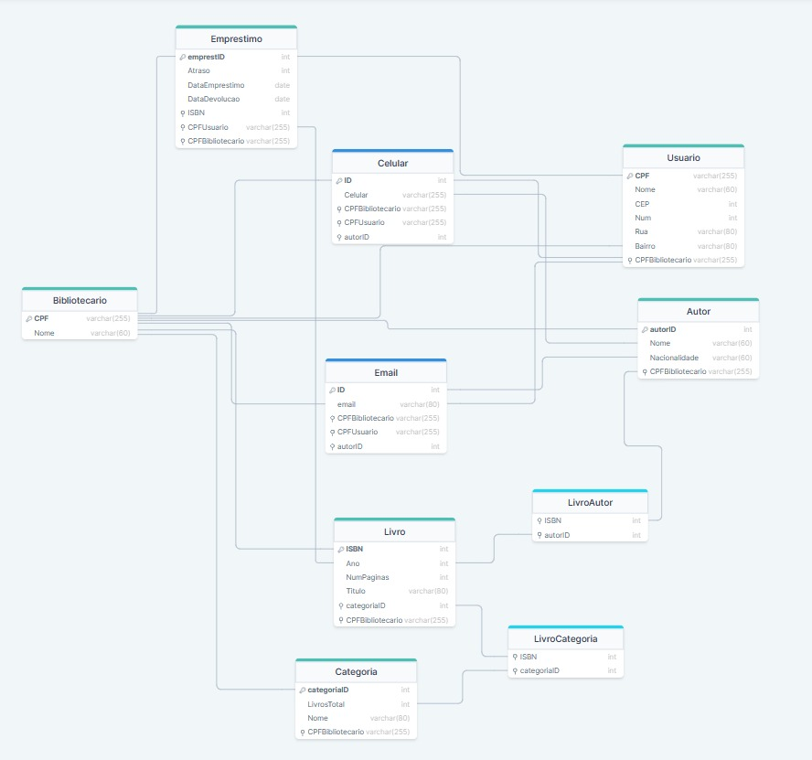
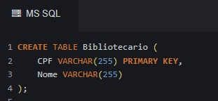
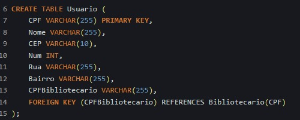
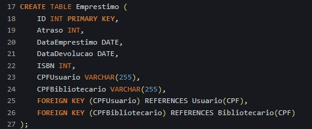
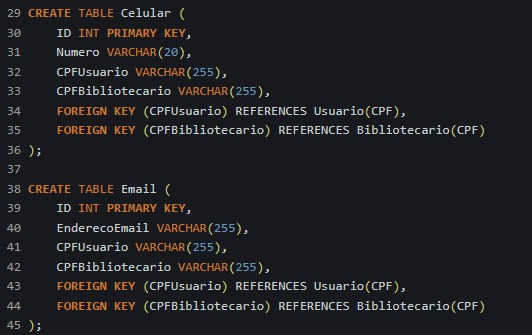
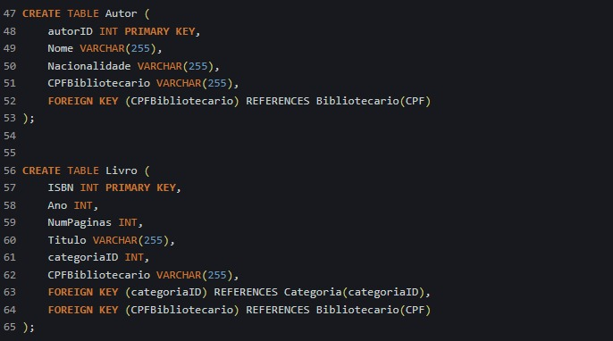
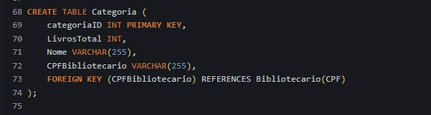
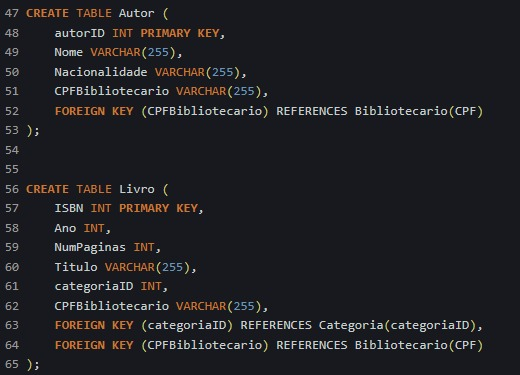

# Trabalho Final de Modelagem de Banco de Dados Completa - 2º Bimestre 

## 💡 Cenário 
* ## Sistema de Gerenciamento para uma Biblioteca 📖
    Uma biblioteca, renomada por sua vasta coleção de obras literárias e comprometida em oferecer serviços eficientes aos seus usuários, busca a implementação de um sistema de 
    gerenciamento abrangente, que possa gerenciar seus usuários, livros, categorias, autores, bibliotecários e empréstimos. A necessidade surge da crescente demanda por uma gestão mais 
    eficaz dos recursos bibliotecários, proporcionando uma experiência organizada e acessível para seus frequentadores. 
  
    No sistema o bibliotecário cadastrado com seu CPF, Nome, Email e Celular, deve ser capaz de gerenciar todo o sistema, podendo cadastrar novos usuários, livros, autores, categorias e 
    empréstimos. 
  
    Cada usuário é cadastrado com CPF, Nome, Email, Celular, Endereço, e o usuário tem direito de pegar somente um livro emprestado por vez. 
  
    Cada livro é cadastrado com seu ISBN, Ano, Quantidade de Páginas, Título e pode ser emprestado um por vez, porém várias vezes, ficando registrado no sistema todo o seu histórico de 
    empréstimos, no qual é registrado com emprestID, Atraso, Data do empréstimo, Data da devolução. 
  
    Cada livro pode ter várias categorias e vice e versa, onde cada categoria é registrada com categoriaID, LivrosTotal, Nome. O sistema deve ser capaz também de calcular quantos livros 
    determinada categoria possui
  
    A implementação de um sistema baseado nesses requisitos permitirá à biblioteca gerenciar eficientemente seu acervo, facilitar transações de empréstimo, e cadastro de novos usuários. 

## 💭 Modelagem Conceitual
    
* ## Entidades e seus Atributos:
  **`AUTOR`** (autorID, Email, Nacionalidade, Nome); 

  **`BIBLIOTECARIO`** (CPF, Nome, Email, Celular); 

  **`CATEGORIA`** (categoriaID, LivrosTotal, Nome); 

  **`EMPRESTIMO`** (emprestID, Atraso, Data do empréstimo, Data da devolução); 

  **`LIVRO`** (ISBN, Ano, Quantidade de Páginas, Título); 

  **`USUÁRIO`** (CPF, Nome, Email, Celular, Endereço); 

* ## Explicando os relacionamentos:
  **Livro e Autor (Muitos para Muitos - N:N):**
  > *Reflete a capacidade de um livro ter vários autores e um autor ter contribuído para vários livros. Essa relação suporta a diversidade de colaborações na criação de obras.*
  
  **Livro e Categoria (Muitos para Muitos - N:N):**
  > *Indica que um livro pode pertencer a várias categorias e, simultaneamente, uma categoria pode abranger vários livros. Isso permite uma classificação versátil dos livros 
    em diferentes temas.*
  
  **Emprestimo e Livro (Um para Muitos - 1:N):**
  > *Estabelece que um livro pode estar associado a vários empréstimos, mas cada empréstimo está relacionado a apenas um livro. Isso permite o rastreamento do histórico de 
  empréstimos de cada livro.*
  
  **Emprestimo e Usuario (Um para Um - 1:1):**
  > *Garante que um usuário pode ter no máximo um livro emprestado por vez. Essa restrição simplifica o controle de empréstimos para cada usuário, promovendo uma gestão mais 
  eficaz.*
  
  **Emprestimo e Bibliotecario (Um para Um - 1:1):**
  > *Define que um empréstimo está associado a um bibliotecário responsável. Isso permite rastrear quem realizou o empréstimo e facilita o gerenciamento do sistema por parte 
    dos bibliotecários.*

  **Bibliotecario e Autor (Um para Muitos - 1:N):**
  
  > *Explicação: Indica que um bibliotecário pode estar associado a vários autores, mas um autor está relacionado a apenas 
    um bibliotecário. Isso pode ser útil para registrar quais bibliotecários são responsáveis por quais autores.*

  **Bibliotecario e Categoria (Um para Muitos - 1:N):**

  > *Explicação: Estabelece que um bibliotecário pode estar associado a várias categorias, mas uma categoria está 
     relacionada a apenas um bibliotecário. Isso pode ser usado para atribuir responsabilidades específicas aos 
     bibliotecários em relação a categorias específicas.*
  
  **Bibliotecario e Livro (Um para Muitos - 1:N):**

  > *Explicação: Indica que um bibliotecário pode estar associado a vários livros, mas um livro está relacionado a apenas 
     um bibliotecário. Isso pode ser útil para rastrear quais bibliotecários são responsáveis por quais livros.*

  **Bibliotecario e Usuario (Um para Muitos - 1:N):**

  > *Explicação: Define que um bibliotecário pode estar associado a vários usuários, mas um usuário está relacionado a 
     apenas um bibliotecário. Isso pode ser usado para atribuir responsabilidades específicas aos bibliotecários em relação 
     aos usuários.*

   **Bibliotecario e Emprestimo (Um para Muitos - 1:N):**

  > *Explicação: Estabelece que um bibliotecário pode estar associado a vários empréstimos, mas um empréstimo está 
     relacionado a apenas um bibliotecário. Isso pode ser útil para rastrear quais bibliotecários são responsáveis por 
     quais transações de empréstimo.*

  Esses relacionamentos formam a estrutura do banco de dados, permitindo uma representação eficaz das interações entre usuários, livros, autores e empréstimos no contexto da biblioteca.
 
## 🧠 Modelagem Lógica
    

## 💻 Modelagem Física
* ## Para a criação do modelo físico, foi utilizado o os seguintes códigos para criação das tabelas: 
     
     
     
     
     
     
     
## 📈 Dados
* ## Aqui está todas as 20 inserções de dados em cada tabela:
## ⚙️ CRUD
## 📝 Relatórios.
